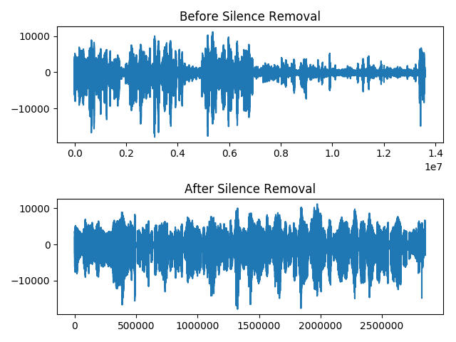
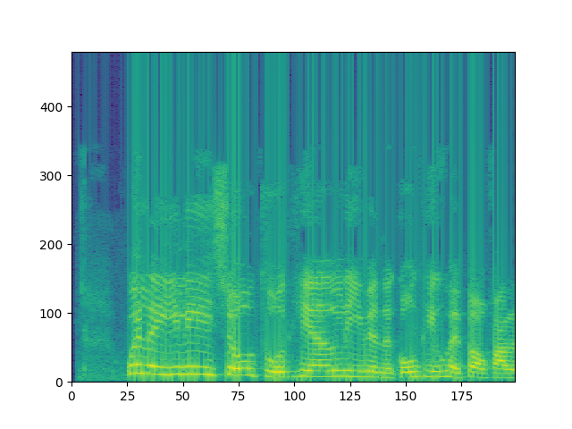

# AudioSegment
Wrapper for [pydub](https://github.com/jiaaro/pydub) AudioSegment objects. An audiosegment.AudioSegment object wraps
a pydub.AudioSegment object. Any methods or properties it has, this also.

**This is in very active development**, and will likely change over the next few months.

Docs are hosted by Read The Docs. [The docs](http://audiosegment.readthedocs.io/en/latest/audiosegment.html).

## Example Usage

### Basic information
```python
import audiosegment

print("Reading in the wave file...")
seg = audiosegment.from_file("whatever.wav")

print("Information:")
print("Channels:", seg.channels)
print("Bits per sample:", seg.sample_width * 8)
print("Sampling frequency:", seg.frame_rate)
print("Length:", seg.duration_seconds, "seconds")
```

### Voice Detection:
```python
# ...
print("Detecting voice...")
seg = seg.resample(sample_rate_Hz=32000, sample_width=2, channels=1)
results = seg.detect_voice()
voiced = [tup[1] for tup in results if tup[0] == 'v']
unvoiced = [tup[1] for tup in results if tup[0] == 'u']

print("Reducing voiced segments to a single wav file 'voiced.wav'")
voiced_segment = voiced[0].reduce(voiced[1:])
voiced_segment.export("voiced.wav", format="WAV")

print("Reducing unvoiced segments to a single wav file 'unvoiced.wav'")
unvoiced_segment = unvoiced[0].reduce(unvoiced[1:])
unvoiced_segment.export("unvoiced.wav", format="WAV")
```

### Silence Removal:
```python
import matplotlib.pyplot as plt

# ...
print("Plotting before silence...")
plt.subplot(211)
plt.title("Before Silence Removal")
plt.plot(seg.get_array_of_samples())

seg = seg.filter_silence(duration_s=0.2, threshold_percentage=5.0)
outname_silence = "nosilence.wav"
seg.export(outname_silence, format="wav")

print("Plotting after silence...")
plt.subplot(212)
plt.title("After Silence Removal")

plt.tight_layout()
plt.plot(seg.get_array_of_samples())
plt.show()
```



### FFT
```python
import matplotlib.pyplot as plt
import numpy as np

#...
# Do it just for the first 3 seconds of audio
hist_bins, hist_vals = seg[1:3000].fft()
hist_vals_real_normed = np.abs(hist_vals) / len(hist_vals)
plt.plot(hist_bins / 1000, hist_vals_real_normed)
plt.xlabel("kHz")
plt.ylabel("dB")
plt.show()
```


### Spectrogram
```python
import matplotlib.pyplot as plt
import numpy as np

#...
# Do it just for the first 3 seconds of audio
hist_bins, times, amplitudes = seg[1:3000].spectrogram(window_length_s=0.03, overlap=0.5)
hist_bins = hist_bins / 1000
amplitudes = np.abs(amplitudes) / len(amplitudes)
amplitudes = 10 * np.log10(amplitudes + 1e-9)

# Plot
x, y = np.mgrid[:len(times), :len(hist_bins)]
fig, ax = plt.subplots()
ax.pcolormesh(x, y, amplitudes)
plt.show()
```



## Notes
There is a hidden dependency on the command line program 'sox'. Pip will not install it for you.
You will have to install sox by:
- Debian/Ubuntu: `sudo apt-get install sox`
- Mac OS X: `brew install sox`
- Windows: `choco install sox`
